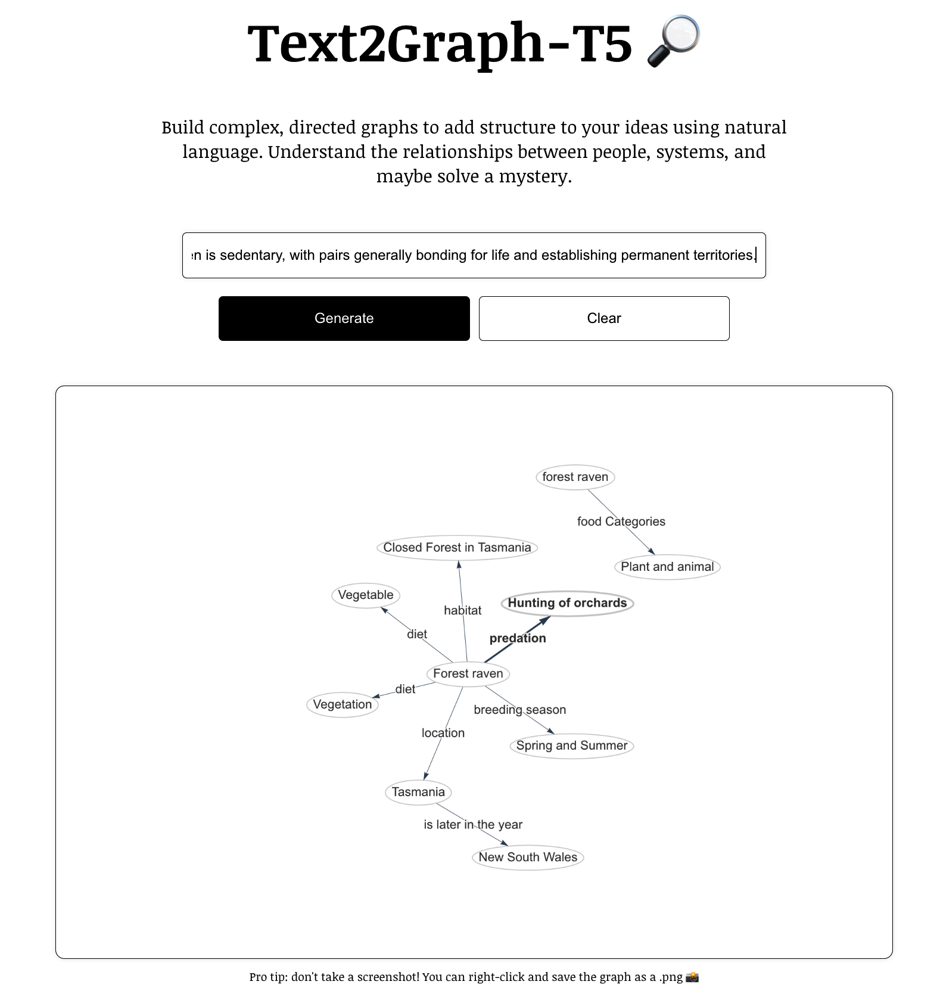

# Text2Graph
Text2Graph model trained with T5

Similar to [GraphGPT](https://github.com/varunshenoy/GraphGPT), this model converts unstructured natural language into a knowledge graph. We provide the trained T5 model for triple extraction. 



## Model
We select T5-base model for training with WebNLG dataset. The model file can be downloaded from [Huggingface](https://huggingface.co/Reacubeth/text2graph).


## Run
1. Backend

Note that you should download our T5 model and put it into the backend folder.

```bash
cd backend
pip install -r requirements.txt 
python apiCore.py
```

2. Frontend
```bash
cd frontend
npm install
npm run start
```
