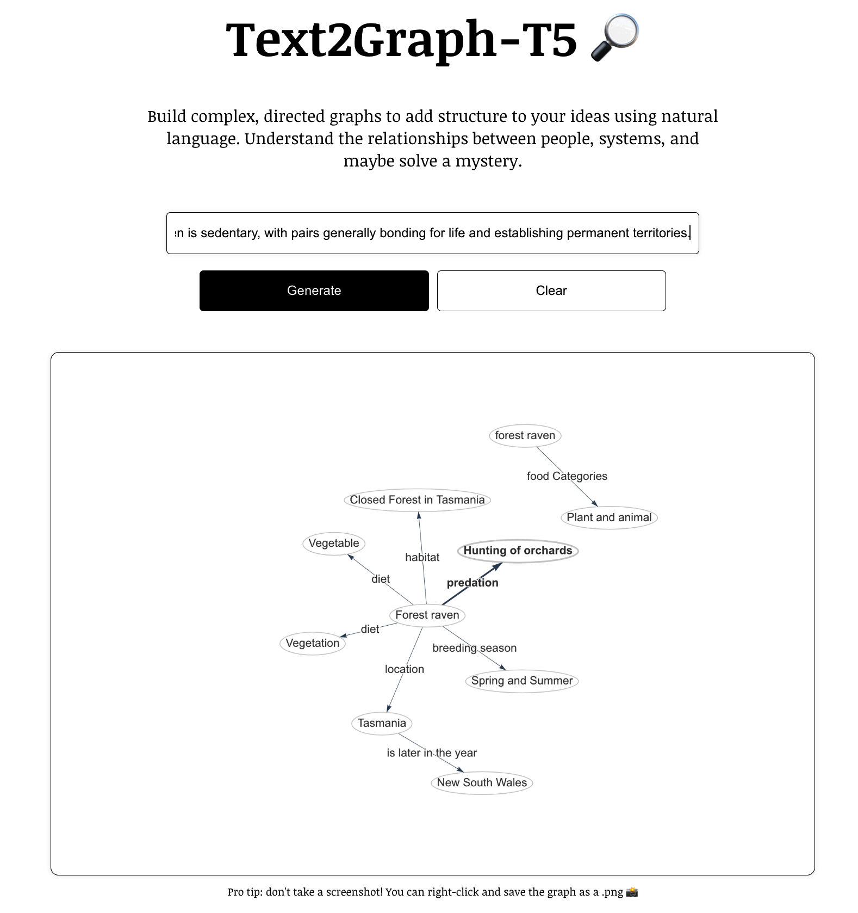

# Text2Gaph-T5
### Natural Language → Knowledge Graph

## Setup

1. Run `npm install` to download required dependencies (currently just [react-graph-vis](https://github.com/crubier/react-graph-vis)).
2. Run `npm run start`. GraphGPT should open up in a new browser tab.
